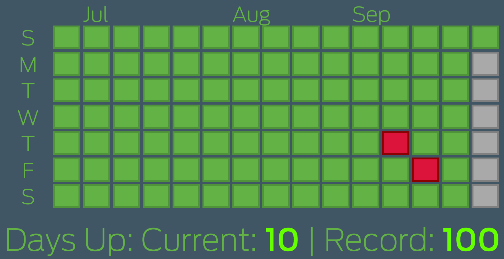

# calendarboard
Github activity graph style calendar display



I wanted a zero-fiddling calendar view for a wall display with a layout like the the github activity calendar.  This is that.

It's driven by a .json document like this:

```JSON
{"longest_streak": {"bad": 100}, "days": {"bad": ["2016-09-16", "2016-09-08", "2016-05-31"]}}
```

You can see it live at: https://ry4an.github.io/calendarboard/
